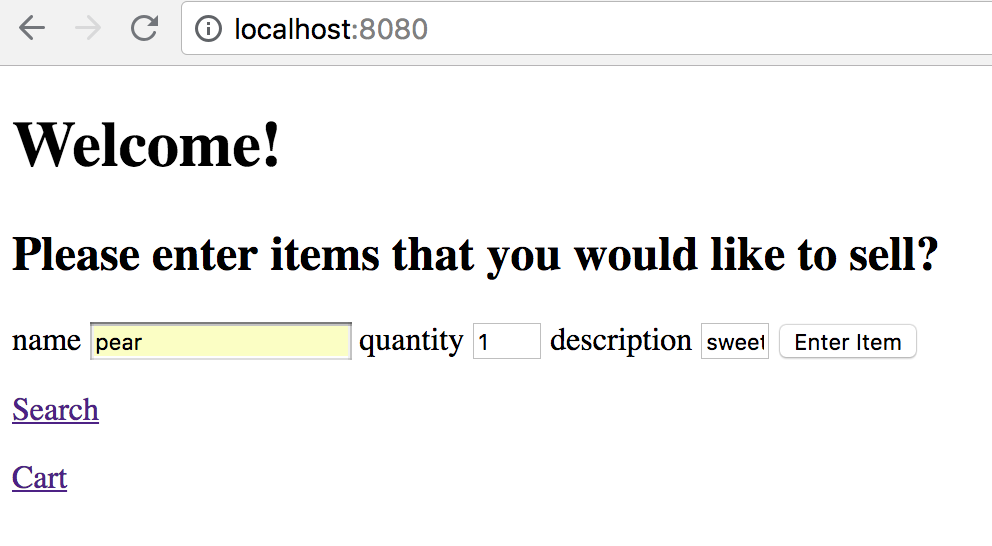
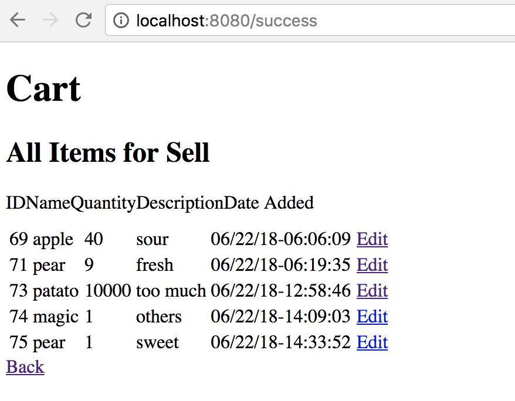
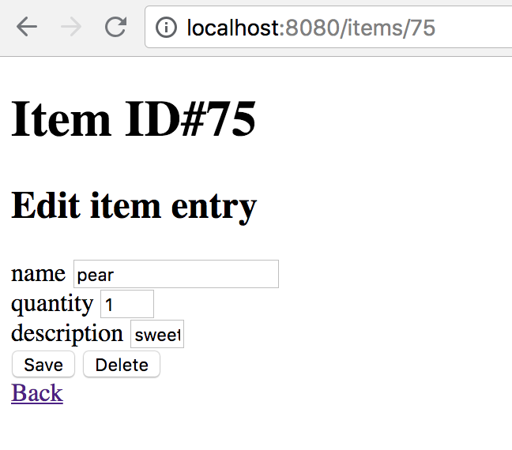
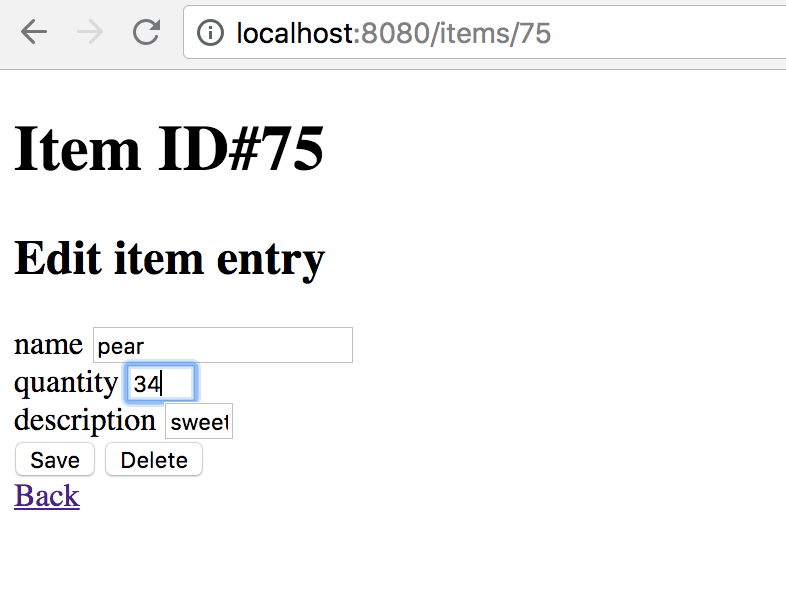
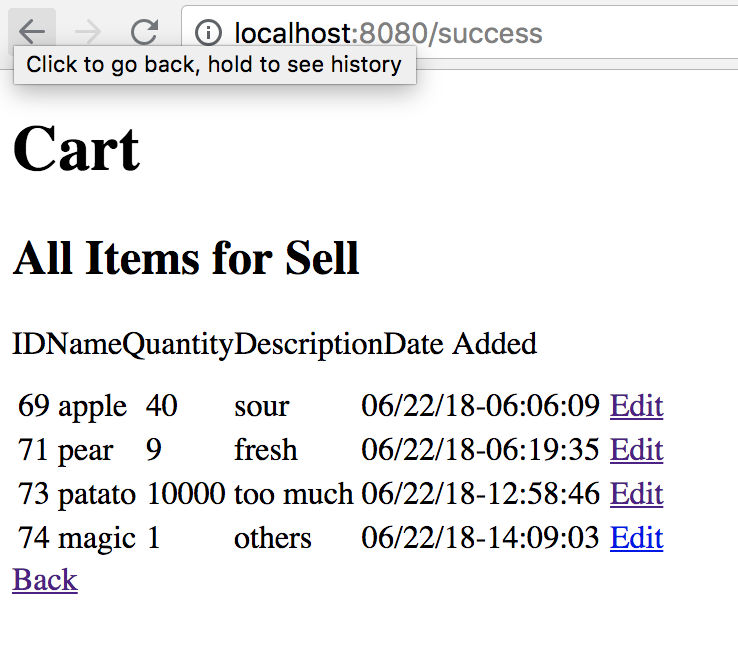
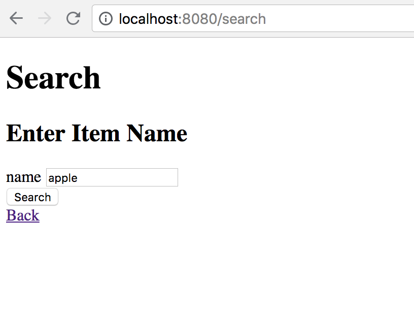
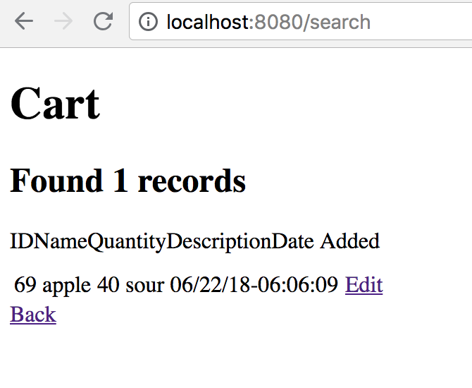

# system-puzzle
For solving Insight Program Puzzle
## Summary

Manually added bugs are corrected in the [system-puzzle](https://github.com/InsightDataScience/systems-puzzle). In addition, **search**, **edit**, **delete** features have been added.

## Usage
* The service runs on port 8080
* Initialization step of PostgreSQL database can be skipped. Directly run the system with `docker-compose up -d`
* Type in `localhost:8080` in any browser to start the app
* Close the app with `docker-compose down`

## API
* `/` is the main page and is used for entering items for sell into the database. Once one entry is entered, it redirects to `/success`. The main page contains links to useful tools.
* `/success` counts the number of items in the cart for sell so far and display them as a table. *Edit* tags redirect to the edit page of the corresponding items.
* `/items/<id>`is the edit page of individual item. *Save* button saves the changes of your edit; *Delete* button removes the entry from database.
* `/cart` print the list of items added so far.
* `/search` provides a search for item names in the database and returns all mached result as a table.
* `/search/<item_name>` provides an alternative to search for item name from web url.

## Usage Example
Step 1: Add items for sell


Step 2: Click Submit


Step 3: Edit item



Step 4: Edit item quantity



Step 5: Click Save


Step 6: Remove Item (Click Delete)



Step 7: Go to /search for searching items



Step 8: Use web url for search (/search/apple)



## Debug Log
Following the instructions in the original repository, database and nginx is initialized successfully.  However, localhost:8080 is not available

> This site can't be reached

It might be a port issue. File docker-compose.yml shows that nginx is not connected to 8080 port on host, but instead connects to port 80. The order is flipped. 

>ports:
>   \-"80:8080"

Correcting the typo gives me 

> 502 Bad Gateway
> nginx/1.13.5

Now nginx service is connected. However, the content is blocked. There is some error in connecting nginx and flaskapp. Reading log messages for flaskapp.

```
flaskapp_1  | * Running on http://0.0.0.0:5000/ (Press CTRL+C to quit)
```

However, nginx is requesting for port 5001.

>connect() failed (111: Connection refused) while connecting to upstream, client: 172.19.0.1, server: localhost, request: "GET / HTTP/1.1", upstream: "http://172.19.0.2:5001/", host: "localhost:8080"

Reading the manual of nginx, the connection configuration file is `conf.d/flaskapp.conf`

```
proxy_pass http://flaskapp:5001;
```

Changing port from 5001 to 5000 solves the problem. Now, the welcome page is available on `localhost:8080`. Adding items on the webpage redirects to `/success` page with a string `[]`. After several tries, it displays `[,,,]`. It seems that items are added but is not visualized correctly. In `app.py`,

```
@app.route("/success")
def success():
    results = []
    qry = db_session.query(Items)
    results = qry.all()
    return str(results)
```

`/success` returns a string converted from a list of `Items` object. However, `Items` have no `__repr__` or `__str__` method according to `models.py`.

```
class Items(Base):
    __tablename__ = 'items'
    id = Column(Integer, primary_key=True)
    name = Column(String(256))
    quantity = Column(Integer)
    description = Column(String(256))
    date_added = Column(DateTime())
```

As a result, a list of empty strings are printed. In stead of strings, a html page is returned using `render_templates`. Reading manuals of flask and jinja2 documents, several other features are created. Since `quantity` property is an interger, `IntegerField` is used instead of `StringField` in `forms.py`.
